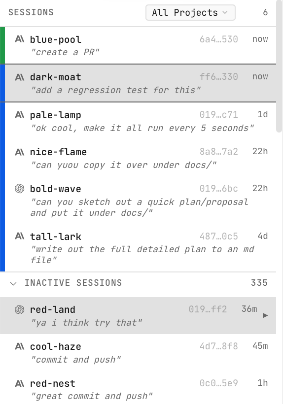

# Agentboard

Web UI for tmux, optimized for agent TUI's (`claude`, `codex`, etc).

Made this because I got sick of using tmux kb shortcuts on my phone, and using Blink.

Run your desktop/server, then connect from your phone or laptop over Tailscale/LAN. Shared workspace across devices.

- iOS Safari mobile experience with:
  - Paste support (including images)
  - Touch scrolling
  - Virtual arrow keys / d-pad
  - Quick keys toolbar (ctrl, esc, etc.)
- Out-of-the-box log tracking and matching for Claude, Codex, and Pi — auto-matches sessions to active tmux windows, with one-click restore for inactive sessions.
- Shows the last user prompt for each session, so you can remember what each agent is working on
- Pin agent TUI sessions to auto-resume them when the server restarts (useful if your machine reboots or tmux dies)

### Desktop
| Terminal | Sessions | Pinning |
| :---: | :---: | :---: |
|  |  |  |

### Mobile
| Terminal | Controls |
| :---: | :---: |
|  |  |

## Requirements

- **Bun 1.3.6+** (required - see [Troubleshooting](#troubleshooting))
- tmux
- A network path to your machine (Tailscale, LAN, etc.)

## Usage

```bash
bun install
bun run dev
```

Open `http://<your-machine>:5173` (Vite dev server). In production, UI is served from the backend port (default 4040).

Production:
```bash
bun run build
bun run start
```

For persistent deployment on Linux, see [systemd/README.md](systemd/README.md).

## Keyboard Shortcuts

| Action | Mac | Windows/Linux |
|--------|-----|---------------|
| Previous session | `Ctrl+Option+[` | `Ctrl+Shift+[` |
| Next session | `Ctrl+Option+]` | `Ctrl+Shift+]` |
| New session | `Ctrl+Option+N` | `Ctrl+Shift+N` |
| Kill session | `Ctrl+Option+X` | `Ctrl+Shift+X` |

## Environment

```
PORT=4040
HOSTNAME=0.0.0.0
TMUX_SESSION=agentboard
REFRESH_INTERVAL_MS=5000
DISCOVER_PREFIXES=work,external
PRUNE_WS_SESSIONS=true
TERMINAL_MODE=pty
TERMINAL_MONITOR_TARGETS=true
VITE_ALLOWED_HOSTS=nuc,myserver
AGENTBOARD_DB_PATH=~/.agentboard/agentboard.db
AGENTBOARD_INACTIVE_MAX_AGE_HOURS=24
AGENTBOARD_EXCLUDE_PROJECTS=<empty>,/workspace
AGENTBOARD_HOST=blade
AGENTBOARD_REMOTE_HOSTS=mba,carbon,worm
AGENTBOARD_REMOTE_POLL_MS=15000
AGENTBOARD_REMOTE_TIMEOUT_MS=4000
AGENTBOARD_REMOTE_STALE_MS=45000
AGENTBOARD_REMOTE_SSH_OPTS=-o BatchMode=yes -o ConnectTimeout=3
AGENTBOARD_REMOTE_ALLOW_CONTROL=false
```

`HOSTNAME` controls which interfaces the server binds to (default `0.0.0.0` for network access; use `127.0.0.1` for local-only).

`DISCOVER_PREFIXES` lets you discover and control windows from other tmux sessions. If unset, all sessions except the managed one are discovered.

`PRUNE_WS_SESSIONS` removes orphaned `agentboard-ws-*` tmux sessions on startup (set to `false` to disable).

`TERMINAL_MODE` selects terminal I/O strategy: `pty` (default, grouped session) or `pipe-pane` (PTY-less, works in daemon/systemd/docker without `-t`).

`TERMINAL_MONITOR_TARGETS` (pipe-pane only) polls tmux to detect closed targets (set to `false` to disable).

`VITE_ALLOWED_HOSTS` allows access to the Vite dev server from other hostnames. Useful with Tailscale MagicDNS - add your machine name (e.g., `nuc`) to access the dev server at `http://nuc:5173` from other devices on your tailnet.

All persistent data is stored in `~/.agentboard/`: session database (`agentboard.db`) and logs (`agentboard.log`). Override paths with `AGENTBOARD_DB_PATH` and `LOG_FILE`.

`AGENTBOARD_INACTIVE_MAX_AGE_HOURS` limits inactive sessions shown in the UI to those with recent activity (default: 24 hours). Older sessions remain in the database but are not displayed or processed for orphan rematch.

`AGENTBOARD_EXCLUDE_PROJECTS` filters out sessions from specific project directories (comma-separated). Use `<empty>` to exclude sessions with no project path. Useful for hiding automated/spam sessions.

`AGENTBOARD_SKIP_MATCHING_PATTERNS` controls which orphan sessions skip expensive window matching (comma-separated). Defaults: `<codex-exec>` (headless Codex exec sessions), `/private/tmp/*`, `/private/var/folders/*`, `/var/folders/*`, `/tmp/*`. Patterns support trailing `*` for prefix matching. Set to empty string to disable skip matching entirely.

`AGENTBOARD_HOST` sets the host label for local sessions (default: `hostname`).

`AGENTBOARD_REMOTE_HOSTS` enables remote tmux polling over SSH. Provide a comma-separated list of hosts (e.g., `mba,carbon,worm`).

`AGENTBOARD_REMOTE_POLL_MS`, `AGENTBOARD_REMOTE_TIMEOUT_MS`, and `AGENTBOARD_REMOTE_STALE_MS` control remote poll cadence, SSH timeout, and stale host cutoff.

`AGENTBOARD_REMOTE_SSH_OPTS` appends extra SSH options (space-separated).

`AGENTBOARD_REMOTE_ALLOW_CONTROL` is reserved for future remote control support (read-only in MVP).

## Logging

```
LOG_LEVEL=info                          # debug | info | warn | error (default: info)
LOG_FILE=~/.agentboard/agentboard.log   # default; set empty to disable file logging
```

Console output is pretty-printed in development, JSON in production (`NODE_ENV=production`). File output is always JSON. Set `LOG_FILE=` (empty) to disable file logging.

## Troubleshooting

### "open terminal failed: not a terminal" errors

If you see infinite `open terminal failed: not a terminal` errors, you need to upgrade Bun:

```bash
bun upgrade
```

**Root cause**: Bun versions prior to 1.3.6 had a bug where the `terminal` option in `Bun.spawn()` incorrectly set stdin to `/dev/null` instead of the PTY. Since `tmux attach` requires stdin to be a terminal, it fails immediately. This was fixed in Bun 1.3.6.
