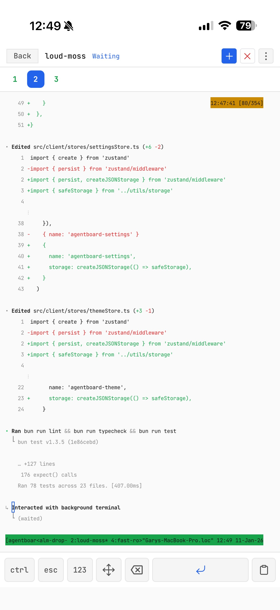
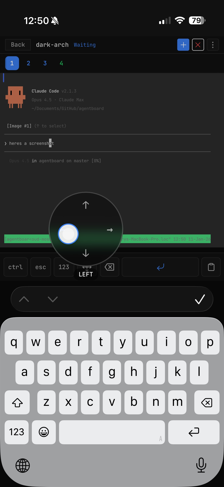

# Agentboard

Web UI for tmux, optimized for agent TUI's (`claude`, `codex`, etc).

Made this because I got sick of using tmux kb shortcuts on my phone, and using Blink.

Run your desktop/server, then connect from your phone or laptop over Tailscale/LAN. Shared workspace across devices.

- iOS Safari mobile experience with:
  - Paste support (including images)
  - Touch scrolling
  - Virtual arrow keys / d-pad
  - Quick keys toolbar (ctrl, esc, etc.)

| Desktop | Mobile |
| :---: | :---: |
|  | <br/> |

## Requirements

- **Bun 1.3.6+** (required - see [Troubleshooting](#troubleshooting))
- tmux
- A network path to your machine (Tailscale, LAN, etc.)

## Usage

```bash
bun install
bun run dev
```

Open `http://<your-machine>:5173` (Vite dev server). In production, UI is served from the backend port (default 4040).

Production:
```bash
bun run build
bun run start
```

For persistent deployment on Linux, see [systemd/README.md](systemd/README.md).

## Keyboard Shortcuts

| Action | Mac | Windows/Linux |
|--------|-----|---------------|
| Previous session | `Ctrl+Option+[` | `Ctrl+Shift+[` |
| Next session | `Ctrl+Option+]` | `Ctrl+Shift+]` |
| New session | `Ctrl+Option+N` | `Ctrl+Shift+N` |
| Kill session | `Ctrl+Option+X` | `Ctrl+Shift+X` |

## Environment

```
PORT=4040
HOSTNAME=0.0.0.0
TMUX_SESSION=agentboard
REFRESH_INTERVAL_MS=5000
DISCOVER_PREFIXES=work,external
PRUNE_WS_SESSIONS=true
TERMINAL_MODE=pty
TERMINAL_MONITOR_TARGETS=true
VITE_ALLOWED_HOSTS=nuc,myserver
```

`HOSTNAME` controls which interfaces the server binds to (default `0.0.0.0` for network access; use `127.0.0.1` for local-only).
`DISCOVER_PREFIXES` lets you discover and control windows from other tmux sessions. If unset, all sessions except the managed one are discovered.
`PRUNE_WS_SESSIONS` removes orphaned `agentboard-ws-*` tmux sessions on startup (set to `false` to disable).
`TERMINAL_MODE` selects terminal I/O strategy: `pty` (default, grouped session) or `pipe-pane` (PTY-less, works in daemon/systemd/docker without `-t`).
`TERMINAL_MONITOR_TARGETS` (pipe-pane only) polls tmux to detect closed targets (set to `false` to disable).
`VITE_ALLOWED_HOSTS` allows access to the Vite dev server from other hostnames. Useful with Tailscale MagicDNS - add your machine name (e.g., `nuc`) to access the dev server at `http://nuc:5173` from other devices on your tailnet.

## Troubleshooting

### "open terminal failed: not a terminal" errors

If you see infinite `open terminal failed: not a terminal` errors, you need to upgrade Bun:

```bash
bun upgrade
```

**Root cause**: Bun versions prior to 1.3.6 had a bug where the `terminal` option in `Bun.spawn()` incorrectly set stdin to `/dev/null` instead of the PTY. Since `tmux attach` requires stdin to be a terminal, it fails immediately. This was fixed in Bun 1.3.6.
